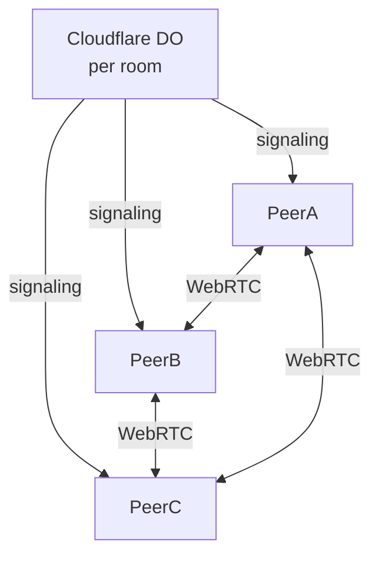
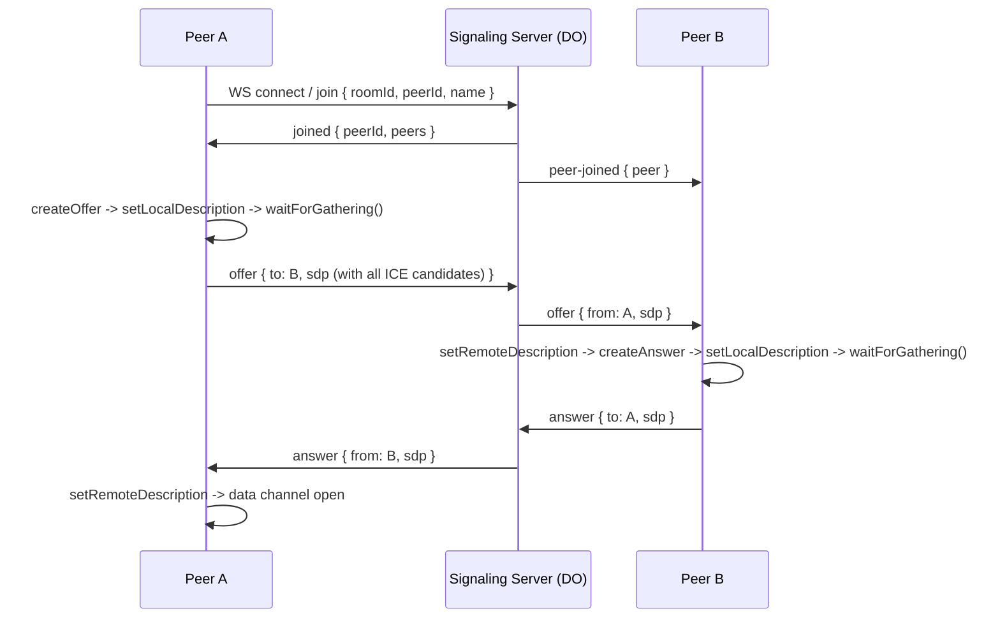
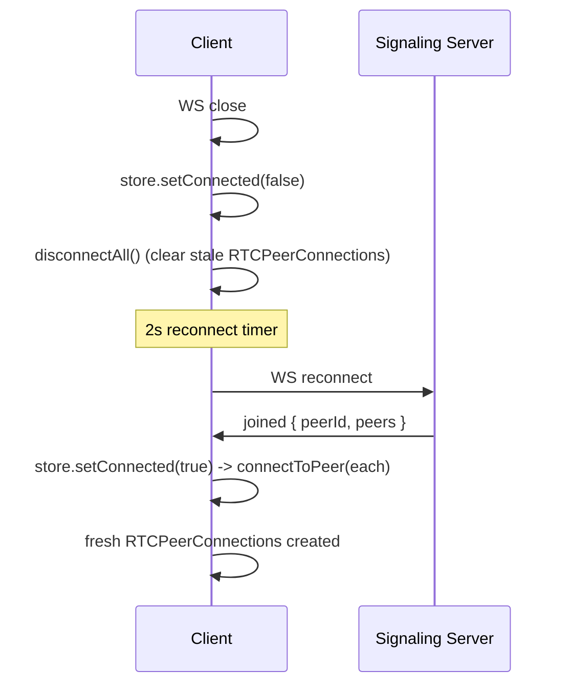
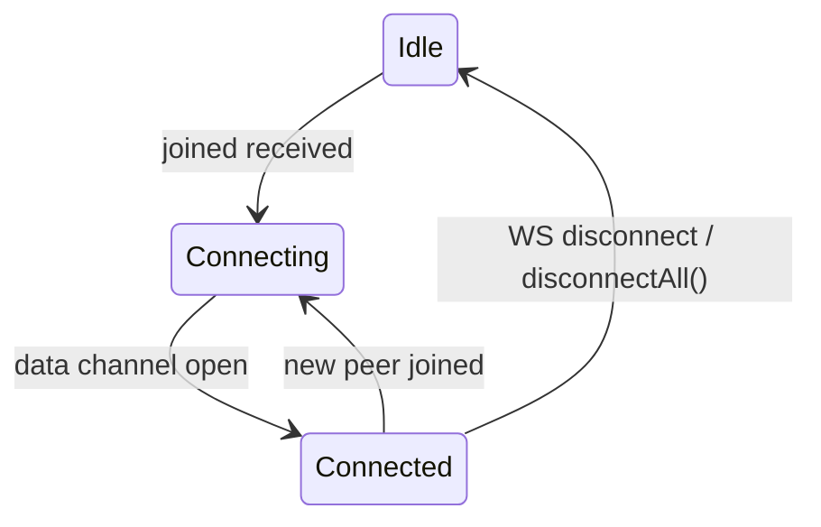

# ZeroRelay Architecture

## Overview

ZeroRelay is a P2P opensource mesh app for sharing files and text directly between browsers. No central database. Each peer owns its own copy of data in IndexedDB (Dexie). The signaling server (Cloudflare Durable Object) only helps peers find each other and exchange WebRTC SDP. Data flows directly browser-to-browser over WebRTC data channels.



## Stack

| Layer | Technology |
|---|---|
| Frontend | Next.js 15 (App Router) |
| State | Zustand |
| Persistence | Dexie v4 (IndexedDB) |
| P2P | WebRTC (full mesh) |
| Signaling | Cloudflare Workers + Durable Objects |
| Styling | Tailwind CSS v4 |


## Key Stores

| Store | What it holds |
|---|---|
| `useRoomStore` | peerId, name, peers[], connected, error |
| `useUIStore` | room list, activeRoomId, dialog state (persisted to localStorage) |
| `useMessageStore` | SharedItem[] in memory, download progress |
| `useAvatarStore` | peerId -> base64 dataUrl map |

## Signaling Handshake



The server only relays offer/answer messages. No trickle ICE — all candidates are bundled into the SDP before sending.

## Reconnection Flow



## WebRTC Connection Lifecycle



Only the peer with the lower `peerId` initiates the offer. This avoids glare without extra coordination.

## Sharing Data

```
Sender: shareItem(item, targetPeerId?)
  -> broadcast(item) via RTCDataChannel
  -> saveMessage(item) to local Dexie
  -> feed updates immediately (optimistic)

Receiver: onmessage -> parse DataMessage
  -> dedupe by id -> saveMessage(item) to local Dexie
  -> feed updates
```

Each peer stores only what it has received. Retention (`session`, `5min`, `1h`, `1d`, `forever`) controls Dexie cleanup.

## Storage (per peer)

| Storage | Content |
|---|---|
| IndexedDB (Dexie) | `messages` table (SharedItem), `avatars` table (peerId -> dataUrl) |
| localStorage | User name, room list (Zustand persist), theme |

## Signaling Server

A Cloudflare Worker routes `/api/ws/:roomId` to a Durable Object (one per room). The DO:
- Validates passwords (first joiner sets it)
- Relays offer/answer between peers
- Broadcasts presence (peer-joined, peer-left, peer-renamed)
- Broadcasts room-deleted

The DO never stores messages, avatars, or any shared data. It is purely in-memory.

## Key Design Decisions

- **Bundled ICE**: wait for `iceGatheringState === "complete"` before sending SDP. No trickle. Eliminates "Unknown ufrag" race conditions.
- **Lower-peerId-wins**: deterministic tie-break for simultaneous offers. Peer with lower id initiates, higher id waits.
- **Read roomId at send time**: `useRoomStore.getState().roomId` instead of passing as a prop. No stale roomId in messages.
- **Full disconnect on WS drop**: `onDisconnect` -> `setConnected(false)` -> `disconnectAll()` clears stale PCs so reconnect creates fresh ones.
- **No server storage**: DO is in-memory only. Messages live in each peer's Dexie.
