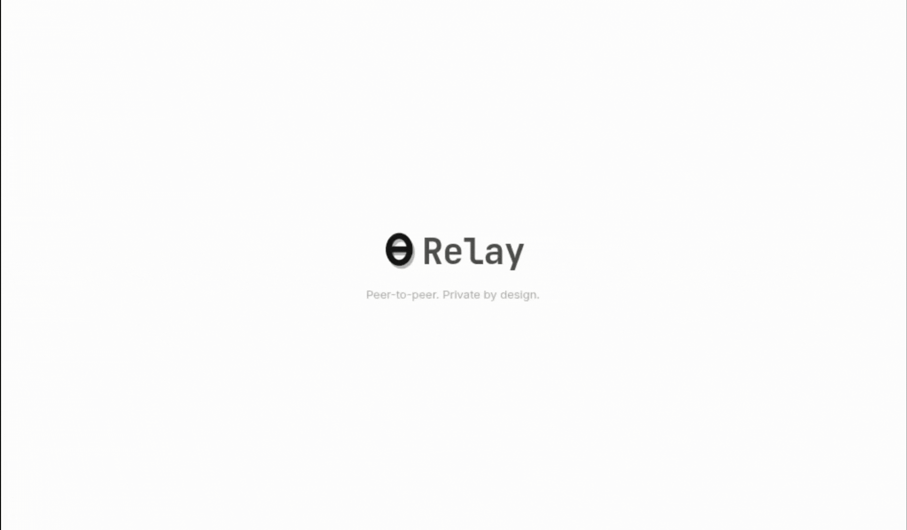
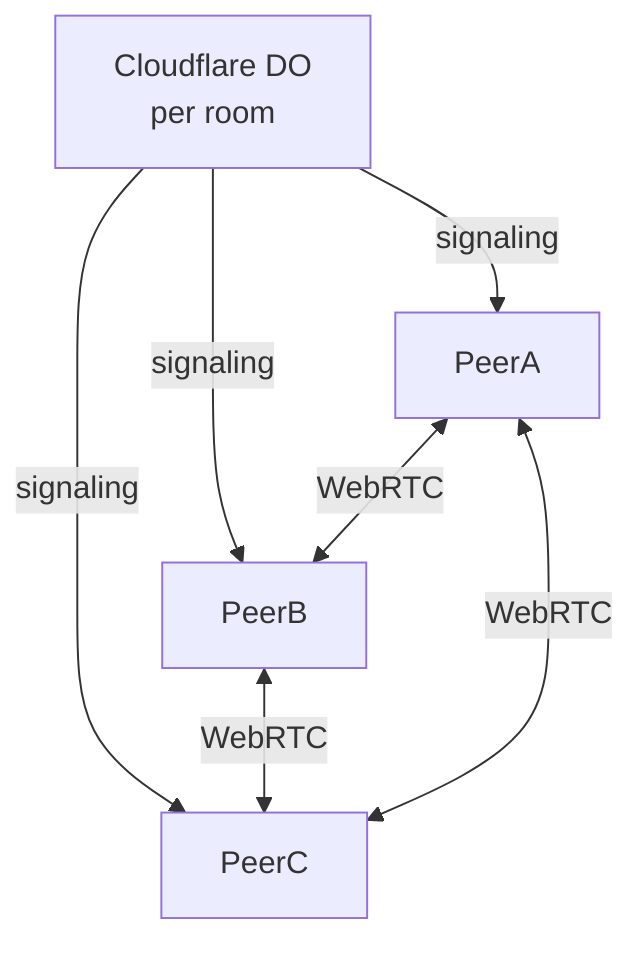

<p align="center">
  
</p>


<h1 align="center">ZeroRelay</h1>

> **ZeroRelay** is a peer-to-peer opensource mesh app for sharing text, code, notes, and files directly between browsers. **No servers store your data** - the signaling server only helps peers discover each other. Everything flows directly between browsers over WebRTC.

<br/>

## Features

| | |
|---|---|
| **P2P Mesh** | Every peer connects directly to every other peer - no central database |
| **Password Rooms** | Room-level passwords enforced by Cloudflare Durable Objects |
| **Share Any Type** | Chat, code (monospace), notes (italic), or files of any size |
| **Retention Model** | Per-item: session, 5min, 1h, 1d, or forever |
| **Zero Backend DB** | IndexedDB on each peer for persistence - nothing stored on the server |

---

## Quick Start

```bash
# 1. Install dependencies
npm install

# 2. Start the frontend
npm run dev

# 3. (separate terminal) Start the signaling worker
npm run dev:worker

# 4. Open http://localhost:3000 in two browser windows
```

---

## Architecture



Each browser stores its own copy of everything in IndexedDB. When you share something, it's broadcast to all connected peers over WebRTC data channels. The signaling server never sees your messages, files, or avatars.

---

## Documentation

**[ARCHITECTURE.md](ARCHITECTURE.md)** - deep dive into data flow, storage, room lifecycle, retention, and security

---

## License
[MIT](LICENSE)
